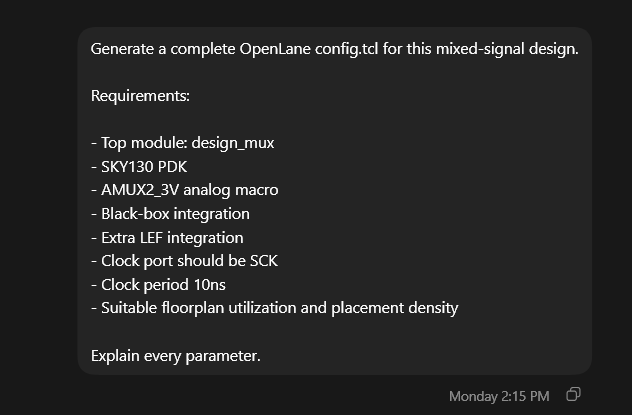
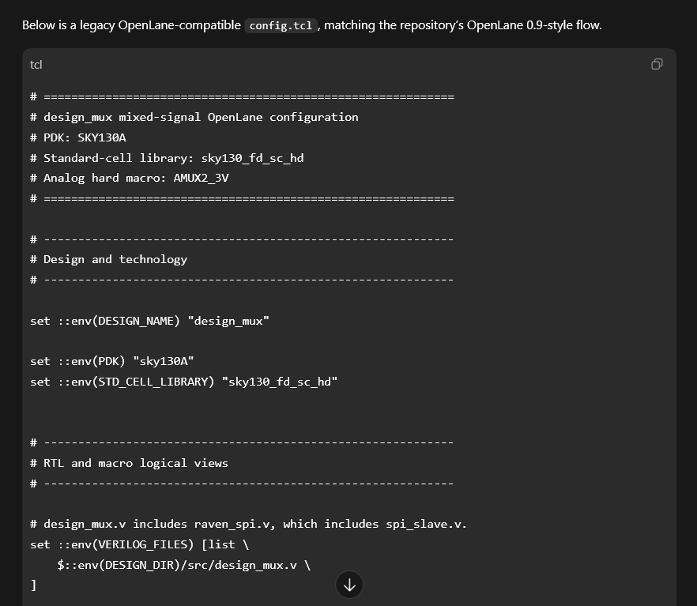

## Objective

Generate an OpenLane configuration file using AI assistance.

---

## AI Tool Used

Codex
ChatGPT

---

## Prompt Used

Generate a complete OpenLane config.tcl for this mixed-signal design.

Requirements:
- Top module: design_mux
- SKY130 PDK
- AMUX2_3V analog macro
- Black-box integration
- Extra LEF integration
- Clock port should be SCK
- Clock period 10ns
- Suitable floorplan utilization and placement density
Explain every parameter.

---

## Screenshots

### Codex Prompt

### Generated Configuration Response

## Generated Artifact

The complete AI-generated OpenLane configuration file is available here:

[config.tcl](../generated_files/config.tcl)

---

## Important Parameters Generated

| Parameter | Purpose |
|------------|----------|
| DESIGN_NAME | Top-level design name (design_mux) |
| VERILOG_FILES | Synthesizable RTL source files |
| VERILOG_FILES_BLACKBOX | Analog macro black-box definition |
| EXTRA_LEFS | Physical abstraction of AMUX2_3V |
| CLOCK_PORT | Design clock signal |
| CLOCK_PERIOD | 10 ns timing constraint |
| FP_CORE_UTIL | Core utilization target |
| PL_TARGET_DENSITY | Placement density target |
| RUN_ROUTING | Enables routing stage |
| RUN_MAGIC | Enables Magic layout generation |

---

## Observation

Codex generated a complete OpenLane-compatible configuration file based on repository analysis. The generated configuration captured RTL sources, macro integration, floorplanning, PDN settings, routing controls, and physical verification stages.

---

## Result

Successfully generated an OpenLane configuration file using AI-assisted design exploration.
