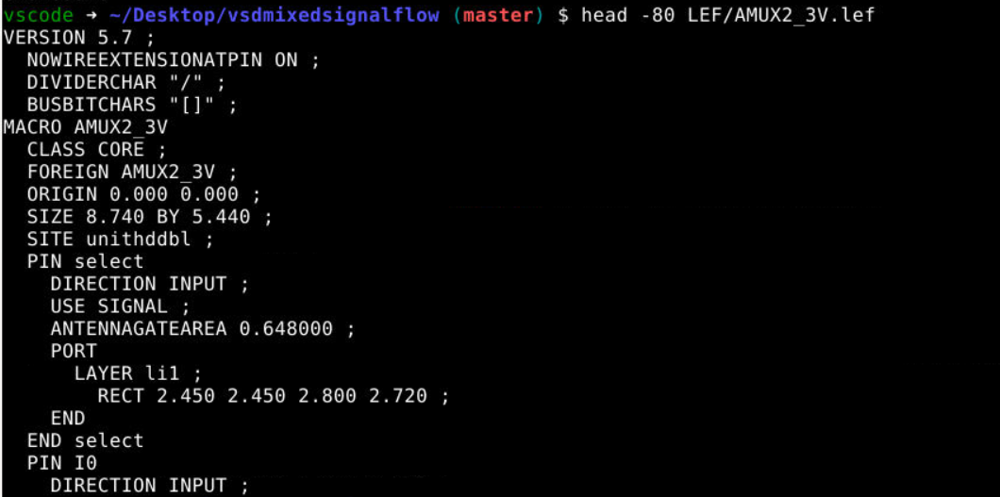
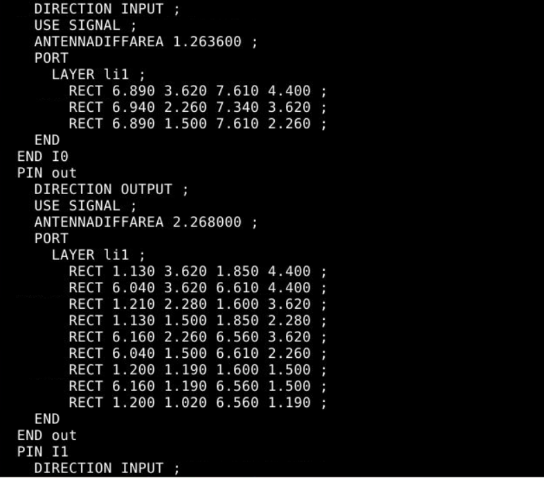
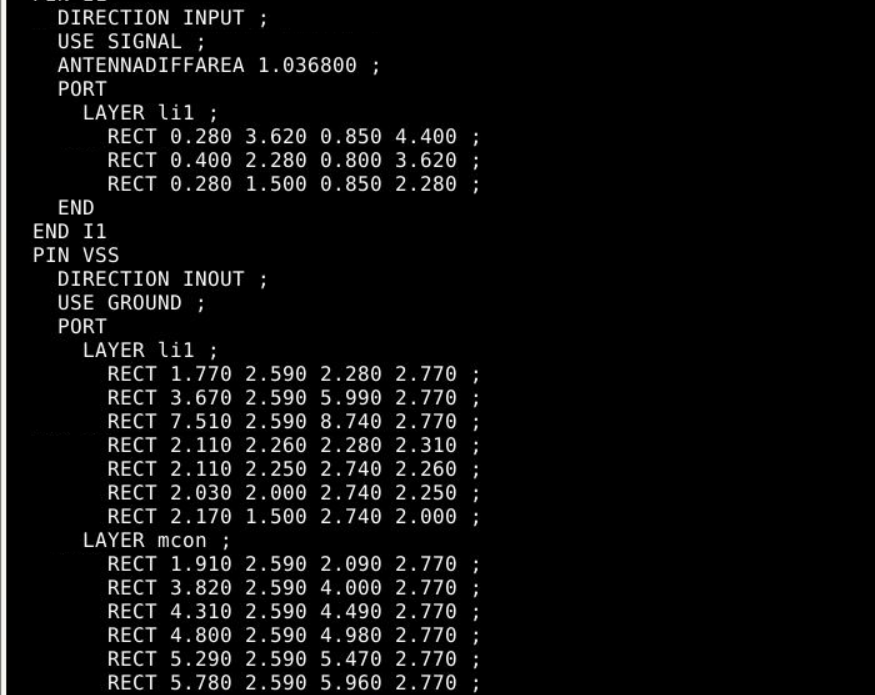
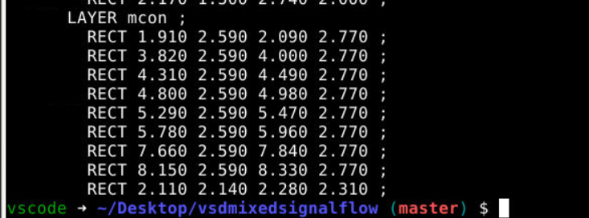
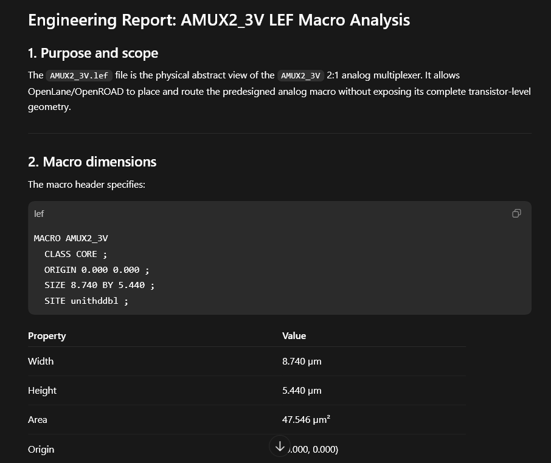

# Experiment 05 - AI-Assisted LEF Macro Analysis

## Objective

To analyze the physical abstraction of the AMUX2_3V analog macro using its LEF (Library Exchange Format) file and understand how OpenLane integrates analog hard macros into a mixed-signal RTL-to-GDSII flow.

---

## AI Tool Used

* Codex
* ChatGPT

---

## Prompt Used

Analyze the AMUX2_3V.lef file and generate a detailed engineering report explaining:

* Macro dimensions
* Pin definitions
* Placement information
* Routing information
* Antenna properties
* Power rail structure
* OpenLane integration requirements

---

## Input File

```text
LEF/AMUX2_3V.lef
```

---

## Screenshots

### LEF File Header



### Pin Definitions





### Codex Analysis Output



---

## Analysis Summary

The LEF file defines the physical abstraction of the AMUX2_3V analog multiplexer macro. It provides the information required by OpenLane and OpenROAD to place and route the macro without exposing its internal transistor-level implementation.

The macro is defined as:

```text
MACRO AMUX2_3V
CLASS CORE
SIZE 8.740 BY 5.440
SITE unithddbl
```

The reported dimensions are:

| Parameter | Value      |
| --------- | ---------- |
| Width     | 8.740 µm   |
| Height    | 5.440 µm   |
| Area      | 47.546 µm² |
| Class     | CORE       |
| Site      | unithddbl  |

The macro occupies approximately two standard-cell rows and is therefore treated as a double-height hard macro.

---

## Pin Analysis

The LEF defines the following external pins:

| Pin    | Direction | Function                  |
| ------ | --------- | ------------------------- |
| select | INPUT     | Multiplexer select signal |
| I0     | INPUT     | Analog input 0            |
| I1     | INPUT     | Analog input 1            |
| out    | OUTPUT    | Analog output             |
| VDD    | INOUT     | Power                     |
| VSS    | INOUT     | Ground                    |

The signal pins are implemented using LI1 routing access geometries, while the power pins provide connections to the macro power distribution network.

---

## Routing Information

The LEF file contains routing-access rectangles for each pin. These rectangles specify legal routing locations that OpenLane may use when connecting the macro to surrounding digital logic.

The file also includes obstruction regions that prevent routing through protected internal analog structures.

---

## Antenna Information

The LEF includes:

* ANTENNAGATEAREA
* ANTENNADIFFAREA

These parameters are used during antenna-rule checking and repair. They help OpenLane determine whether routing modifications or diode insertion are required to prevent manufacturing-related antenna effects.

---

## OpenLane Integration Role

The LEF abstraction enables OpenLane to perform:

* Macro placement
* Floorplanning
* Routing access generation
* Congestion analysis
* PDN integration
* DEF generation

Without the LEF file, OpenLane would be unable to determine the macro dimensions, pin locations, or routing constraints.

---

## Key Findings

1. The analog macro is represented as a hard macro using LEF abstraction.
2. The macro uses a double-height placement site.
3. Physical pin locations are defined using LI1 routing geometries.
4. Power and ground rails are exposed for PDN integration.
5. Antenna information is included for physical verification.
6. The LEF enables seamless integration of analog circuitry into a digital OpenLane flow.

---

## Result

Successfully analyzed the AMUX2_3V LEF abstraction using AI-assisted engineering review and identified the key physical-design information required for mixed-signal macro integration.
