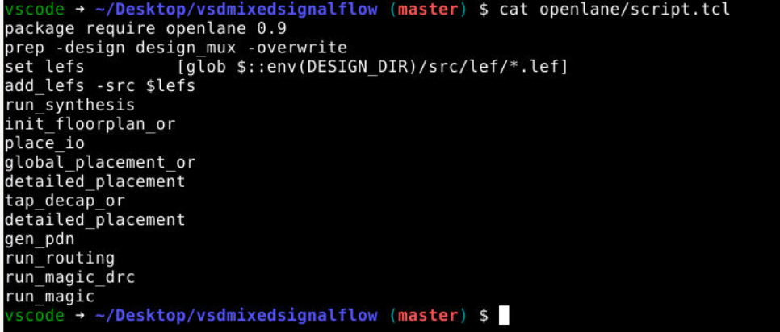
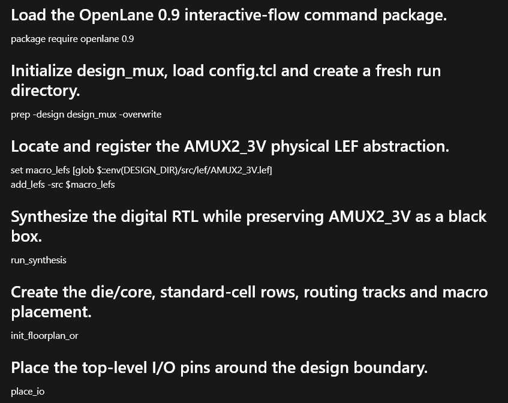

# Experiment 06 - OpenLane Flow Script Analysis

## Objective

To analyze the OpenLane automation script used in the reference repository and understand how each command contributes to the RTL-to-GDSII implementation flow.

---

## AI Tool Used

- Codex
- ChatGPT

---

## Prompt Used

Analyze the OpenLane script.tcl file and explain the purpose of every command used in the RTL-to-GDSII implementation flow.

---

## Input File

```text
openlane/script.tcl
```

---

## Screenshots

### OpenLane Script



### AI Generated Flow Analysis



---

## Script Contents

```tcl
package require openlane 0.9
prep -design design_mux -overwrite
set lefs [glob $::env(DESIGN_DIR)/src/lef/*.lef]
add_lefs -src $lefs
run_synthesis
init_floorplan_or
place_io
global_placement_or
detailed_placement
tap_decap_or
detailed_placement
gen_pdn
run_routing
run_magic_drc
run_magic
```

---

## Command Analysis

| Command | Purpose |
|----------|----------|
| package require openlane 0.9 | Loads OpenLane 0.9 command package |
| prep | Initializes the design and creates a new run directory |
| add_lefs | Loads analog macro LEF abstractions |
| run_synthesis | Synthesizes RTL into a gate-level netlist |
| init_floorplan_or | Creates die area and floorplan |
| place_io | Places I/O pins around the design boundary |
| global_placement_or | Performs coarse placement of standard cells |
| detailed_placement | Legalizes placement and removes overlaps |
| tap_decap_or | Inserts tap cells and decoupling capacitors |
| gen_pdn | Generates the power distribution network |
| run_routing | Performs global and detailed routing |
| run_magic_drc | Executes Magic DRC verification |
| run_magic | Generates the final Magic layout and GDS |

---

## Flow Stages Identified

The script implements the following physical design stages:

1. Design Initialization
2. LEF Integration
3. RTL Synthesis
4. Floorplanning
5. I/O Placement
6. Cell Placement
7. Physical Cell Insertion
8. Power Distribution Network Generation
9. Signal Routing
10. Design Rule Checking
11. Final Layout Generation

---

## Observations

The script demonstrates a complete OpenLane-based RTL-to-GDSII flow for the mixed-signal design. The analog AMUX2_3V macro is integrated through LEF abstraction before synthesis and physical implementation. The flow includes all major physical design stages required to generate a manufacturable layout.

The use of automation scripts enables reproducible design execution while reducing manual intervention during implementation.

---

## Key Findings

1. OpenLane automates the complete RTL-to-GDSII implementation flow.
2. Analog macros are integrated through LEF abstractions.
3. Power planning is performed through PDN generation.
4. Routing and DRC verification are included in the automated flow.
5. Final layout generation is handled through Magic VLSI.

---

## Result

Successfully analyzed the OpenLane implementation script and identified the sequence of commands used to perform synthesis, floorplanning, placement, routing, verification, and layout generation for the mixed-signal design.
